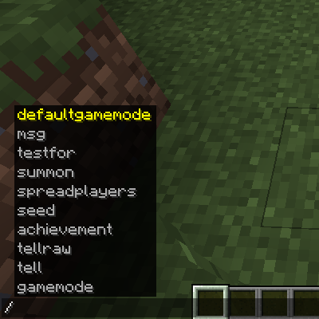

# Salutation

A mod that ports back the command system from 1.19.2 or newer to older minecraft versions.    


It also comes with a Mini Brigardier system which is also compatible with vanilla mc versions.

Here is an example.
```java

public class ExampleCommand extends BaseSalutationCommand {
	public ExampleCommand() {
		super("example");
		
		CommandBuilder builder = new CommandBuilder("test");
		builder.arg("info", BooleanArgument.bool(), this::runTest);
		builder.arg("format", StringArgument.text(), this::runTest).popTop(); //PopTop to allow the next sub command to begin.
		addChild(builder.build());
	}
	
	private static void runTest(CommandContext context) {
		boolan value = context.getArgument("info", Boolean.class);
		String text = context.getArgumentOrDefault("format", String.class, "Nothing");
		if(text.equals("dont")) {
			context.sendSuccess(TranslationUtils.literal("WOOOOOOO")));
		}
		
		//DO STUFF;
	}
}

```
